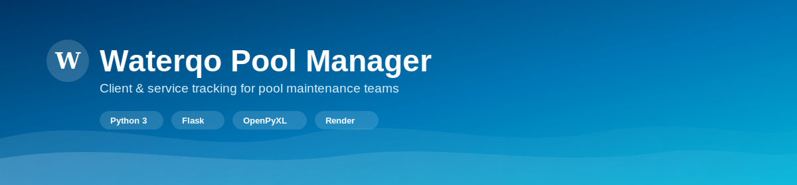
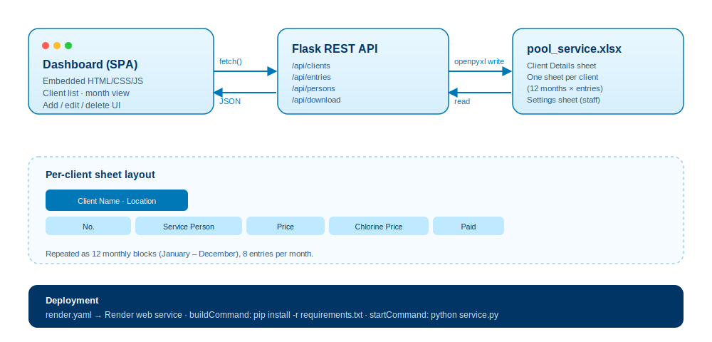

<div align="center">
  

  <p>
    
    
    
    
    
  </p>
</div>

## What is this?

**Waterqo Pool Manager** is a single-file Flask app for tracking recurring pool service clients — locations, assigned technicians, and month-by-month service entries (price, chlorine cost, payment status).

Everything is stored in one Excel workbook: a master **Client Details** sheet plus a dedicated, auto-formatted sheet per client with a 12-month service log. No database to provision — the `.xlsx` file is the database, and it's downloadable straight from the dashboard.

## Architecture



## Features

| | |
|---|---|
| 🧑‍🤝‍🧑 **Client Directory** | Add, search, and delete clients by name, location, or assigned service person. |
| 📅 **Monthly Service Log** | 8 entries per month, per client — price, chlorine cost, and payment status. |
| 💳 **Payment Status** | Color-coded **Paid**, **Partial**, **Unpaid**, and **Empty** badges, with automatic monthly totals. |
| 👷 **Staff List** | Maintain the roster of service technicians, stored in its own `Settings` sheet. |
| 📊 **One Sheet per Client** | Each client gets a styled, self-contained Excel sheet — readable outside the app. |
| ⬇️ **One-Click Export** | Download the full workbook (`pool_service.xlsx`) directly from `/api/download`. |
| ☁️ **Render-Ready** | Ships with `render.yaml` for a one-click web service deployment. |

## Tech stack

- **Backend:** Python 3, Flask (single-file app, embedded frontend)
- **Data layer:** OpenPyXL (styled `.xlsx` read/write, no external DB)
- **Frontend:** Vanilla HTML/CSS/JS, served directly from `service.py`
- **Deployment:** Render (`render.yaml` included)

## API reference

| Endpoint | Method | Purpose |
|---|---|---|
| `/api/clients` | GET / POST | List clients / add a new client |
| `/api/clients/delete` | POST | Remove a client and their sheet |
| `/api/entries` | GET / POST | Fetch or save a month's service entries |
| `/api/persons` | GET / POST | List or add service technicians |
| `/api/persons/delete` | POST | Remove a technician from the roster |
| `/api/download` | GET | Download the full `pool_service.xlsx` |

## Project structure

```
waterqo-pool-manager/
├── service.py             # Flask app + embedded dashboard UI + Excel logic
├── pool_service.xlsx      # Pool service data (auto-created on first run)
├── requirements.txt       # Python dependencies
├── render.yaml             # Render deployment configuration
└── assets/                 # README banner & diagram assets
```

## Getting started

**Requirements:** Python 3.10+, pip

```bash
# 1. Clone the repository
git clone https://github.com/YehenSilva/waterqo-pool-manager.git
cd waterqo-pool-manager

# 2. Install dependencies
pip install -r requirements.txt

# 3. Run the app
python service.py
```

Open **http://localhost:5050** in your browser. On first run, `service.py` creates `pool_service.xlsx` with the correct headers and styling automatically.

## Data management

`pool_service.xlsx` is the single source of truth:

- **Client Details** — the master list of clients, locations, and assigned technicians.
- **One sheet per client** — named `"{Client Name} {Location}"`, holding 12 months of service entries.
- **Settings** — the editable list of service technicians shown in dropdowns.

You can open and edit the file directly in Excel or Google Sheets between app sessions — the structure is preserved as long as headers and sheet names stay intact.

## Deployment

This project ships with a ready-to-use `render.yaml`:

1. Push the repository to GitHub.
2. Create a new **Web Service** on [Render](https://render.com) and connect the repo.
3. Render detects `render.yaml` and applies the build/start commands automatically.
4. Deploy — the service listens on the `PORT` environment variable Render provides.

## Roadmap ideas

- [ ] Authentication for multi-user access
- [ ] Recurring/scheduled service reminders
- [ ] Export a single client's sheet as a standalone PDF report
- [ ] Optional SQLite backend for larger client bases

## License

Released under the [MIT License](LICENSE).

---

<div align="center">
  <sub>Built for Waterqo Swimming Pools — one workbook, every client, zero database headaches.</sub>
</div>
